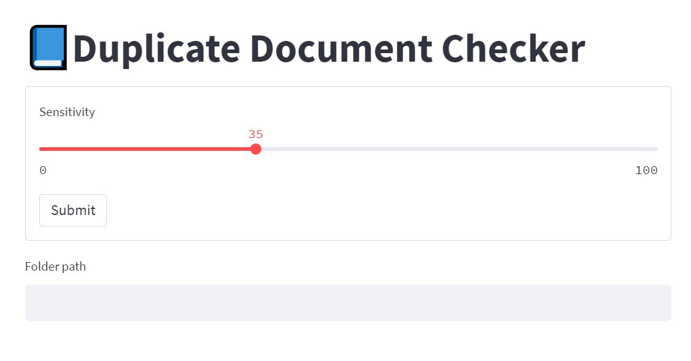
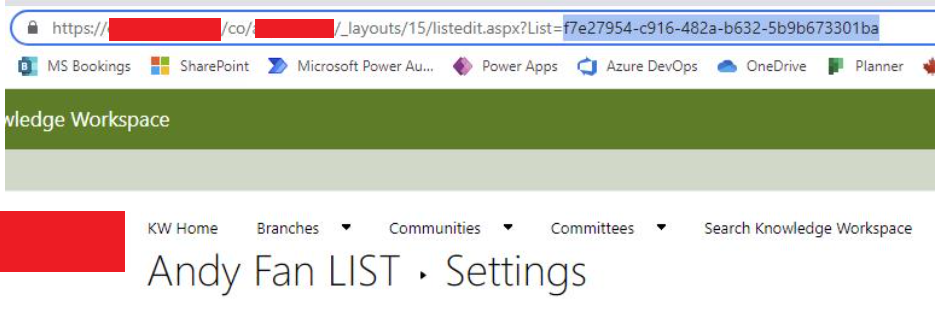
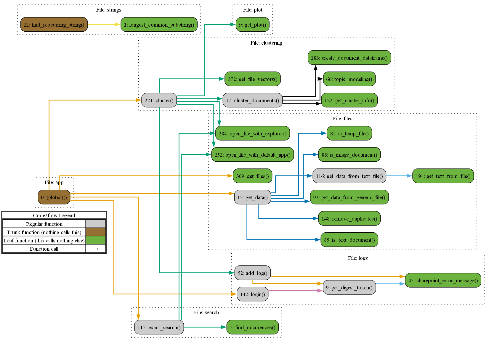
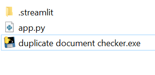
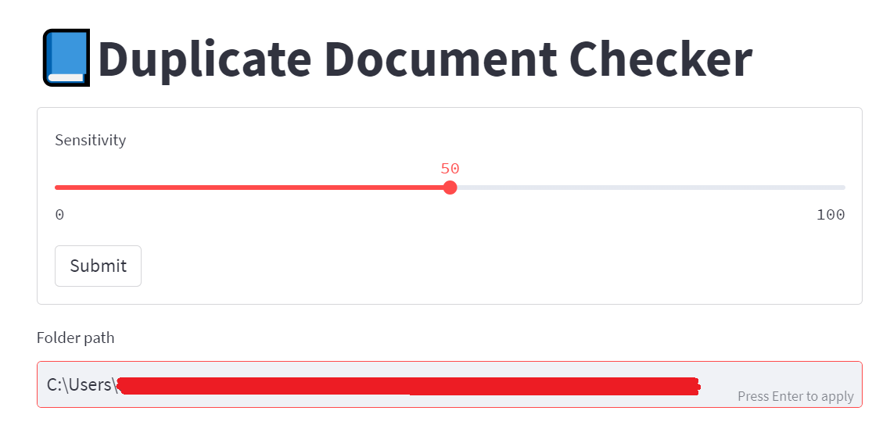
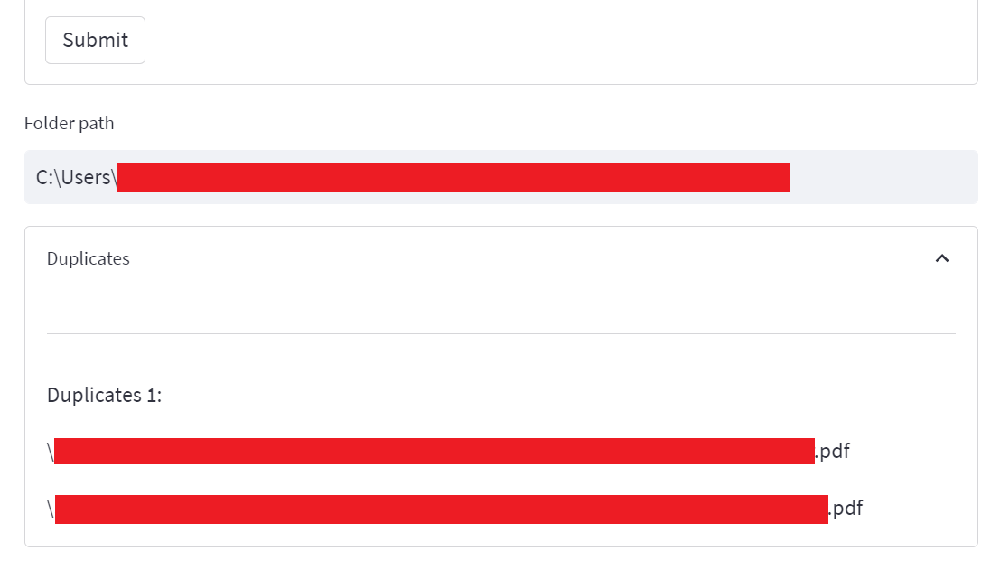
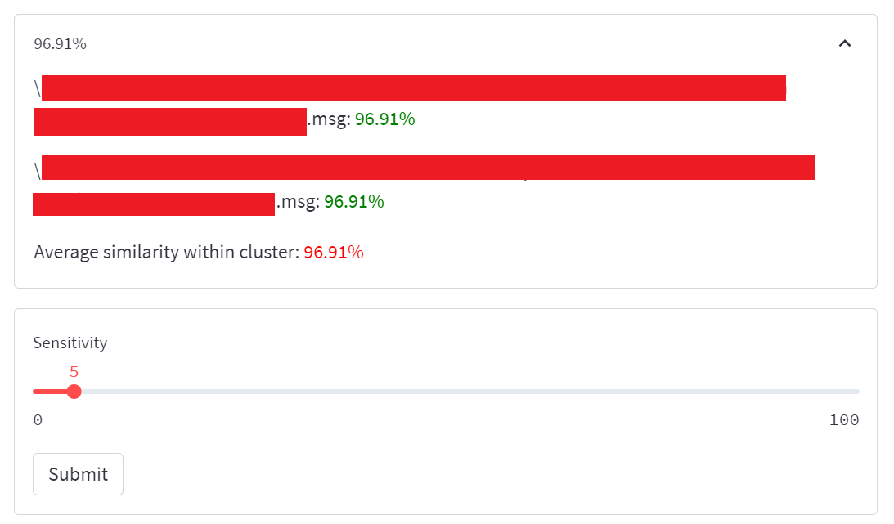

# Document Similarity Checker

This tool is intended to help find duplicates and near-duplicate files in a directory tree.



## Reproducibility

### Creating the .exe file

To create the executable follow the following steps.

1. Clone the repo
   
2. Install python

3. Install dependencies (preferably in a virtual environment)
```bash
#Open your command line and navigate to where you cloned this repo.

# Create virtual environment
python -m venv venv

# Activate the virtual environment
venv\Scripts\activate

# Install dependencies
pip install -r requirements.txt

# Install package to create the executable
pip install cx_freeze
```

4. Modify the `venv\Lib\site-packages\streamlit\web\cli.py` script
```python
# Paste the following function inside the cli.py script
def main_run_clExplicit(file, command_line, args=[], flag_options=[]):
    main.is_running_with_streamlit = True
    bootstrap.run(file, command_line, args, flag_options)
```

5. Run this command: `python setup.py build`

6. Copy the `.streamlit/` folder and the `app.py` script into the new `build/exe.win-amd64-3.10/` folder.
   
7. Copy the streamlit, imapclient, and sklearn folders from `venv/Lib/site-packages/` to `build/exe.win-amd64-3.10/lib/`. And replace any duplicate files.

If you want to develop the tool, you can, after activating the virtual environment, you can run the command `streamlit run deduplication/app.py` and the tool will run without needing to build the executable.

### Setting up the logger




## Type of data used

Up to Protected B.

## Code flow diagram



## Usage

An executable file is being distributed for using this application.



**Note**: The .exe file must be in the same folder as the app.py and .streamlit folders.

Once open, paste the path to the folder where you want to check if the documents are duplicates. Then press `Enter`



The list of duplicates will appear at the bottom after the application finishes analyzing the files.



Then, you can select an appropriate similarity sensitivity to find documents that have high degrees of similarity.



Try to start with lower sensitivities first, and then increase gradually to see how this parameter affects the clustering.

## Business owner

This tool was created for helping ATIP agents. In the future, it could be used more broadly.

## Acknowledgements

So far, Rafael Moraes and Hardik Munjal have contributed to this project.

## Sources

[Packaging Streamlit apps into executables](https://001gc.sharepoint.com/sites/72164/SitePages/Packaging-Streamlit-apps-into-executables.aspx)